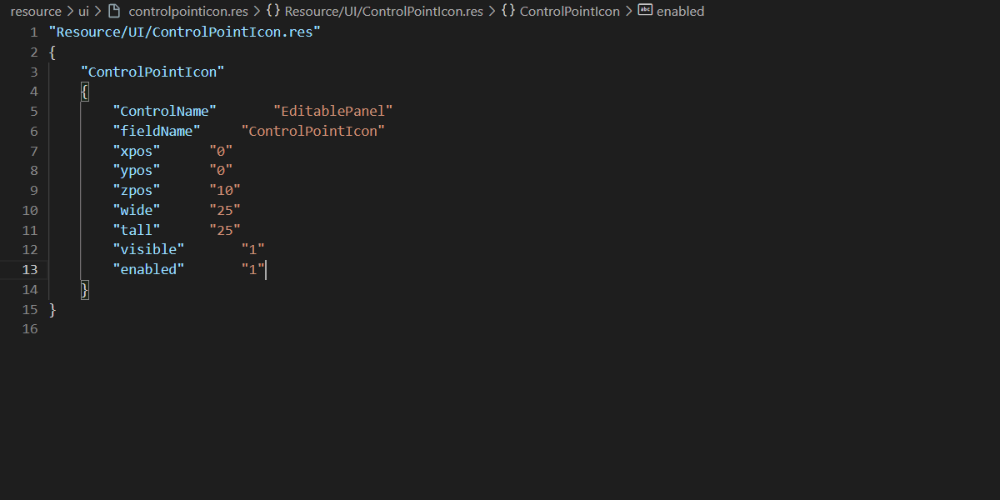

# VSCode VDF Language Support

VDF/Valve KeyValues language support for VSCode

### Features
 - Syntax highlighting
 - File formatting
 - Autocompletion for key/values
 - Go To Definition/Find References for key/values
 - View/Edit VTF files
 - Convert VDF to JSON
 - Convert JSON to VDF

### Features (HUD)
 - Definition Provider
    - All Clientscheme properties
    - labelText
    - pin_to_sibling
    - image
 - Codelens for Clientscheme references
 - Autocompletion for element properties:
    - ImagePanel => image, scaleImage, etc...
    - CExLabel => labelText, font, textAlignment, fgcolor, etc...
 - Autocompletion for property values
    - textAlignment => center, north, east, south, west
    - font => Will suggest from clientscheme
    - labelText => Will suggest from chat_english.txt and tf_english.txt
 - Autocompletion for #base paths
 - Autocompletion for image paths
 - Autocompletion for pin_to_sibling elements
 - Rename HUD elements

### Features (HUD Animations)
 - Autocompletion for keywords, HUD elements (from associated files), common properties, clientscheme values, interpolators
 - Warning for duplicate/unused events
 - Codelens for event references
 - Go To Definition/Find References for events
 - Rename events
 - Syntax highlighting for HUD Animations

### Features (Popfile)
 - Definition Provider
    - Templates
 - Autocompletion for Attributes, BehaviorModifiers, Class, Skill, Objective, etc...
 - Autocompletion for property values:
    - Template => Will suggest from Templates
    - ClassIcon => Will suggest files
 - Colour picker for "set item tint rgb"
 - Link to ClassIcon
 - Import #base templates into Popfile
 - Rename Templates (file wide)

### Features (VMT)
 - Autocompletion for common key/values
 - Autocompletion for property values:
    - $baseTexture => Will suggest texture files
 - Colour picker for $color (Supports int and float colours)
 - Link to `$baseTexture`, `$detail`

### Credits
 - [Revan](https://github.com/cooolbros) - Code
 - [randomguy](https://steamcommunity.com/profiles/76561198056380662) - Popfile knowledge
 - [Windolon](https://github.com/Windolon) - Testing
 - [Sergeant Table](https://steamcommunity.com/profiles/76561199046757586) - Testing

Github: https://github.com/cooolbros/vscode-vdf

Docs: https://cooolbros.github.io/vscode-vdf

VS Marketplace: https://marketplace.visualstudio.com/items?itemName=pfwobcke.vscode-vdf

Open VSX Registry: https://open-vsx.org/extension/pfwobcke/vscode-vdf
