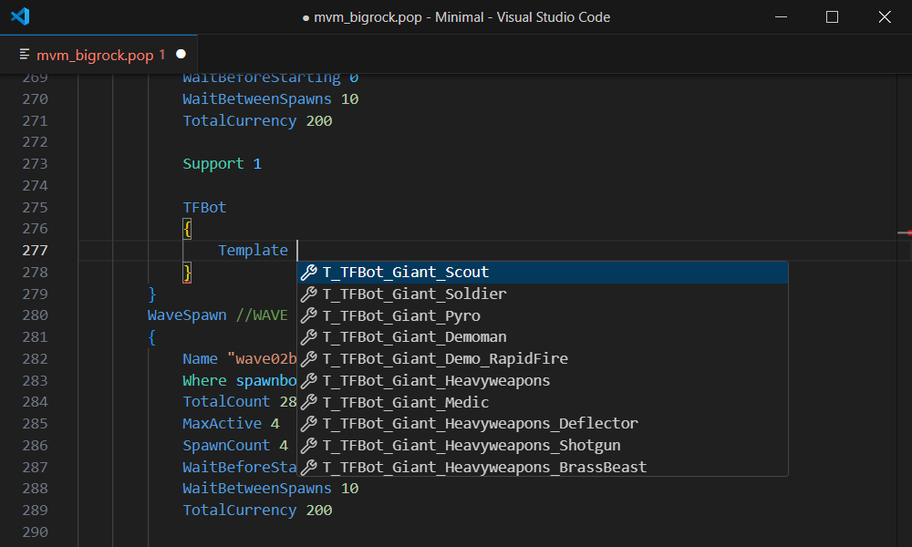
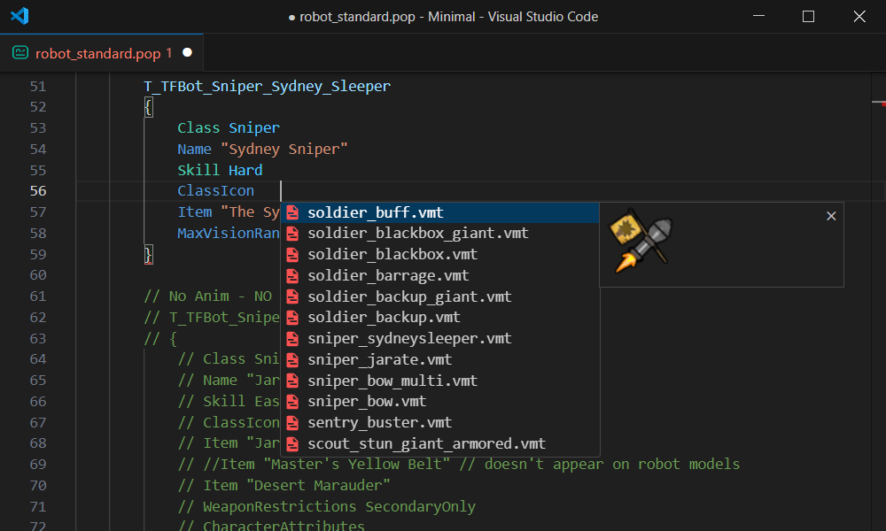
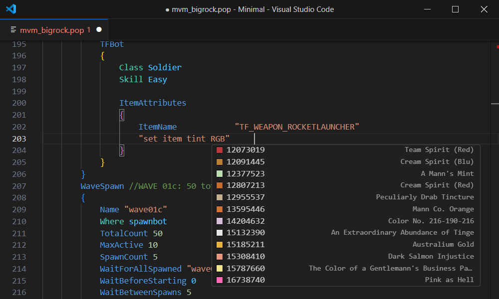
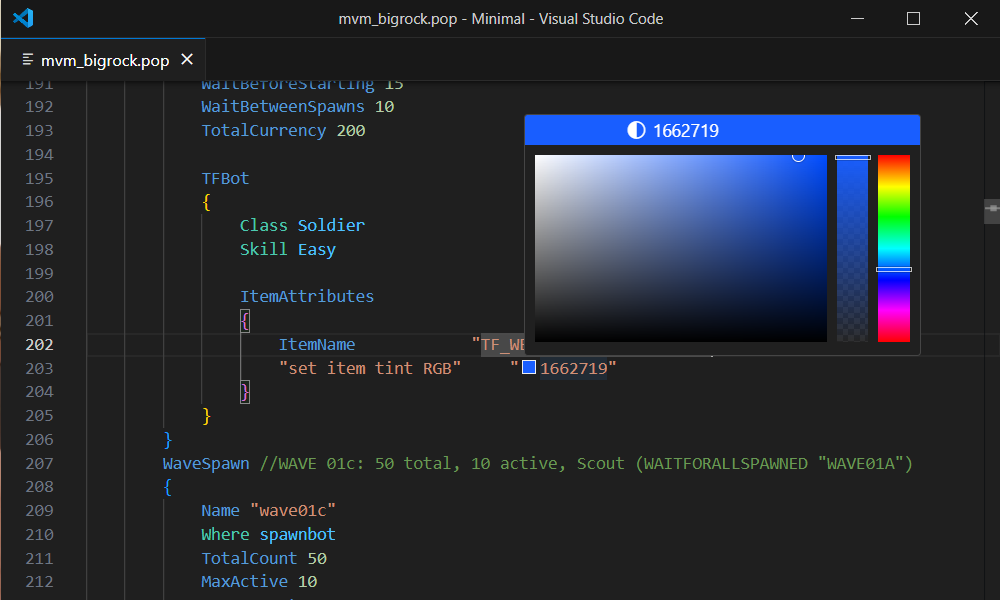

import Image from "next/image"

# Popfile Features

### Syntax Highlighting

```popfile copy=false
#base	robot_standard.pop
#base	robot_giant.pop

WaveSchedule
{
	StartingCurrency				400
	CanBotsAttackWhileInSpawnRoom	No
	RespawnWaveTime					5

	Wave
	{
		WaveSpawn
		{
			Where				spawnbot
			TotalCount			15
			MaxActive			10
			SpawnCount			5
			TotalCurrency		400

			TFBot
			{
				Class	Scout
				Skill	Normal
			}
		}
	}
}
```

### Syntax Error Checking


### Warnings


### Auto Completion

#### Keys


#### Values


#### Templates



#### Class Icons



#### Paints



### Go to definition

`Ctrl`+`Click` or `F12` on a template or wavespawn name to go to the definition

*[VSCode Reference](https://code.visualstudio.com/docs/editor/editingevolved#_go-to-definition)*

Supports (Popfile):
 - `Template`
 - `WaitForAllSpawned`
 - `WaitForAllDead`


### Links

Links for `ClassIcon`


### Colour Picker

Colour picker for `"set item tint RGB"{:popfile}`


