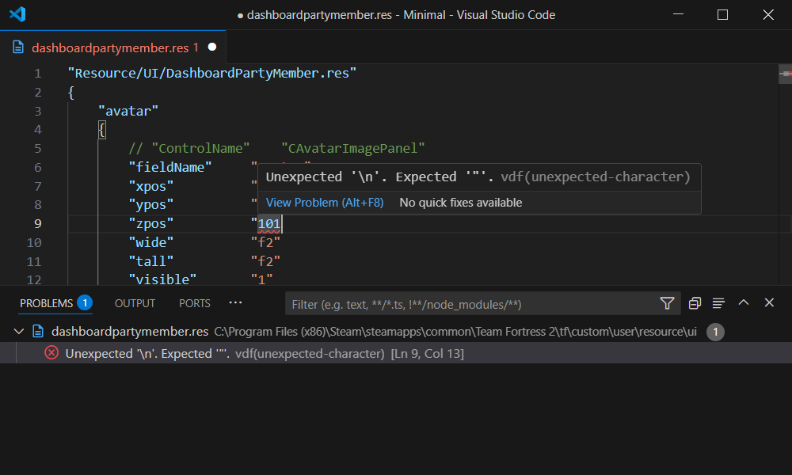
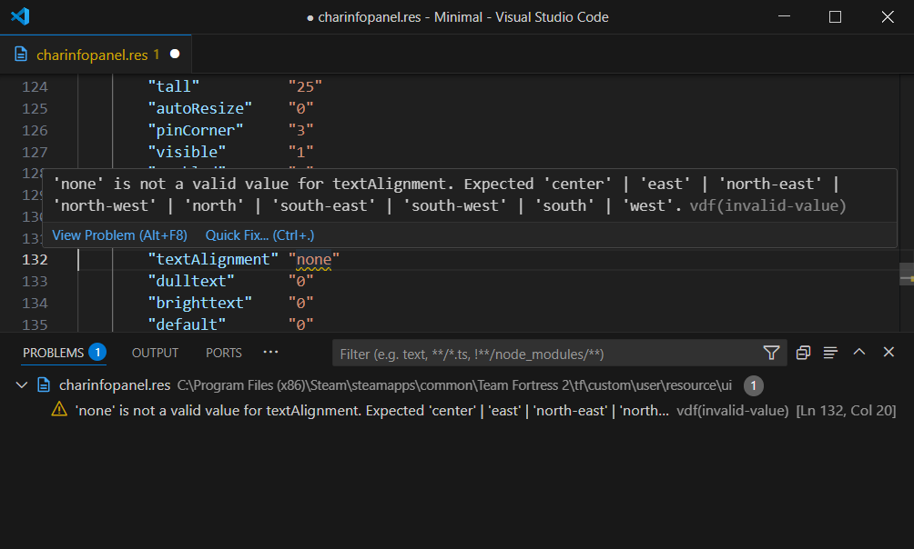
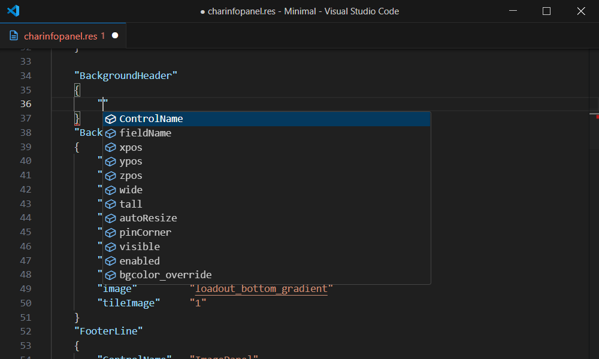
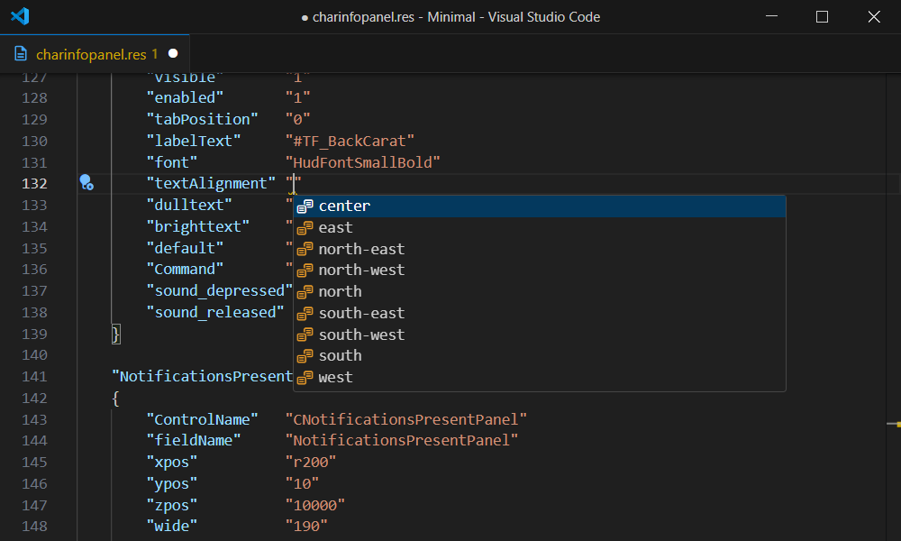
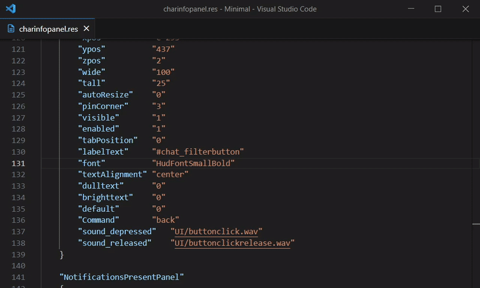

import Image from "next/image"

# VGUI Features

### Syntax Highlighting

```vdf copy=false
#base "MatchMakingDashboardSidePanel.res"

"Resource/UI/MatchMakingDashboardPlayList.res"
{
	"ExpandableList"
	{
		"fieldName"		"ExpandableList"
		"xpos"			"r0"
		"ypos"			"10"
		"zpos"			"1001"
		"wide"			"280"
		"tall"			"f70"
		"visible"		"1"
		"proportionaltoparent"	"1"
	}
}
```

### Syntax Error Checking



### Warnings



### Auto Completion

#### Keys



#### Values



### Go to definition

`Ctrl`+`Click` or `F12` on an element or clientscheme name to go to the definition

*[VSCode Reference](https://code.visualstudio.com/docs/editor/editingevolved#_go-to-definition)*

Supports (VGUI):
 - `pin_to_sibling`
 - Clientscheme `Colors`, `Borders` and `Fonts` (`bgcolor_override`, `border`, `font` ...etc)
 - Language Tokens (`labelText` ...etc)


