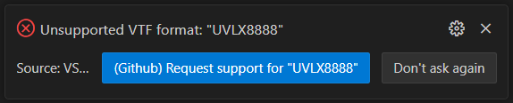

import { Table } from "nextra/components"

# VSCode VDF Settings

Settings for configuring the behaviour of VSCode VDF


## filesAutoCompletionKind

`vscode-vdf.filesAutoCompletionKind`

Controls the behaviour of suggesting autocompletion file items.

| `incremental`                                   | `all`                                                                |
|-------------------------------------------------|----------------------------------------------------------------------|
| Suggests folders and files in current directory | Suggests files only, recursively, with nested files seperated by `/` |
|                |                                                     |

*Default:* `incremental`

## teamFortress2Folder

`vscode-vdf.teamFortress2Folder`

Path to `Team Fortress 2` folder

*Default:* `C:/Program Files (x86)/Steam/steamapps/common/Team Fortress 2`

## updateDiagnosticsEvent

`vscode-vdf.updateDiagnosticsEvent`

Controls when to update file diagnostics

| `type`                                | `save`                                          |
|---------------------------------------|-------------------------------------------------|
| Update file diagnostics in real time. | Update file diagnostics when the file is saved. |

*Default:* `type`

## vtf

### formats

#### exclude

`vscode-vdf.vtf.formats.exclude`

List of VTF formats to skip showing a notification for when opening a VTF file with a format that is currently not supported.

This setting is modified by VSCode VDF when clicking `Don't ask again` in the `Unsupported VTF format` notification:



Possible List Values:
 - `RGBA8888`
 - `ABGR8888`
 - `RGB888`
 - `BGR888`
 - `RGB565`
 - `I8`
 - `IA88`
 - `P8`
 - `A8`
 - `RGB888BlueScreen`
 - `BGR888BlueScreen`
 - `ARGB8888`
 - `BGRA8888`
 - `DXT1`
 - `DXT3`
 - `DXT5`
 - `BGRX8888`
 - `BGR565`
 - `BGRX5551`
 - `BGRA4444`
 - `DXT1OneBitAlpha`
 - `BGRA5551`
 - `UV88`
 - `UVWQ8888`
 - `RGBA16161616F`
 - `RGBA16161616`
 - `UVLX8888`

*Default:* `[]`

> [!NOTE]
>
> The currently supported VTF image formats include
>
> `RGBA8888`\
> `ABGR8888`\
> `RGB888`\
> `BGR888`\
> `I8`\
> `A8`\
> `RGB888BlueScreen`\
> `BGR888BlueScreen`\
> `ARGB8888`\
> `BGRA8888`\
> `DXT1`\
> `DXT3`\
> `DXT5`
>
> Including any of these formats in `vscode-vdf.vtf.formats.exclude` will have no effect

## HUD Animations `hudanimations`

### format

#### insertNewlineAfterEvents

`vscode-vdf.hudanimations.format.insertNewlineAfterEvents`

Whether to insert a newline after events when formatting.

<br />

<Table>
	<thead>
		<Table.Tr>
			<Table.Th>Value</Table.Th>
			<Table.Th>Example</Table.Th>
		</Table.Tr>
	</thead>
	<tbody>
		<Table.Tr className="even:bg-transparent even:dark:bg-transparent">
			<Table.Td>false</Table.Td>
			<Table.Td>
			```hudanimations copy=false
			event HudHealthBonusPulse
			{
				Animate PlayerStatusHealthValue Fgcolor "0 255 0 255" Linear    0    0
			}
			event HudHealthBonusPulseStop
			{
				Animate PlayerStatusHealthValue Fgcolor "255 255 255 255" Linear    0    0
			}

			```
			</Table.Td>
		</Table.Tr>
		<Table.Tr className="even:bg-transparent even:dark:bg-transparent">
			<Table.Td>true</Table.Td>
			<Table.Td>
			```hudanimations copy=false
			event HudHealthBonusPulse
			{
				Animate PlayerStatusHealthValue Fgcolor "0 255 0 255" Linear    0    0
			}

			event HudHealthBonusPulseStop
			{
				Animate PlayerStatusHealthValue Fgcolor "255 255 255 255" Linear    0    0
			}
			```
			</Table.Td>
		</Table.Tr>
	</tbody>
</Table>

*Default:* `true`

#### layoutScope

`vscode-vdf.hudanimations.format.layoutScope`

Controls the scope to align tokens with when formatting HUD animations.

*Default:* `event`

#### tabs

`vscode-vdf.hudanimations.format.tabs`

Controls the number of tabs to insert after a token when formatting HUD animations.

*Default:* `1`

### suggest

#### enable

`vscode-vdf.hudanimations.suggest.enable`

Enable/disable autocomplete suggestions.

*Default:* `true`

## Popfile `popfile`

### diagnostics

#### strict

`vscode-vdf.popfile.diagnostics.strict`

Whether to strictly allow only known keys.

*Default:* `true`

### format

#### insertNewlineBeforeObjects

`vscode-vdf.popfile.format.insertNewlineBeforeObjects`

Whether to insert a newline before objects when formatting.

*Default:* `true`

#### quotes

`vscode-vdf.popfile.format.quotes`

Whether to surround tokens with double quotes when formatting.

*Default:* `false`

#### tabs

`vscode-vdf.popfile.format.tabs`

How many tabs to insert between keys and values when formatting. `-1` = Insert a single space

*Default:* `0`

### suggest

#### enable

`vscode-vdf.popfile.suggest.enable`

Enable/disable autocomplete suggestions.

*Default:* `true`

### vscript

#### enable

`vscode-vdf.popfile.vscript.enable`

Enable/disable VScript language support.

*Default:* `true`

### waveStatusPreview

Settings for configuring the style of the [Wave Status Preview](/features/popfile#wave-status-preview)

#### background

##### colour

`vscode-vdf.popfile.waveStatusPreview.background.colour`

Background colour for Wave Status Preview.

*Default:* `rgb(31, 31, 31)`

##### sky

Show/Hide sky for Wave Status Preview.

`vscode-vdf.popfile.waveStatusPreview.background.sky`

*Default:* `true`

#### font

##### bold

`vscode-vdf.popfile.waveStatusPreview.font.bold`

Bold font for Wave Status Preview.

> [!WARNING]
>
> Must be installed if *not* `TF2 Build` or `TF2 Secondary`.

*Default:* `TF2 Build`

##### regular

`vscode-vdf.popfile.waveStatusPreview.font.regular`

Regular font for Wave Status Preview.

> [!WARNING]
>
> Must be installed if *not* `TF2 Build` or `TF2 Secondary`.

*Default:* `TF2 Secondary`

#### language

`vscode-vdf.popfile.waveStatusPreview.language`

Possible Values:
 - `English`
 - `Deutsch (German)`
 - `Français (French)`
 - `Italiano (Italian)`
 - `한국어 (Korean)`
 - `Español-España (Spanish-Spain)`
 - `简体中文 (Simplified Chinese)`
 - `繁體中文 (Traditional Chinese)`
 - `Русский (Russian)`
 - `ไทย (Thai)`
 - `日本語 (Japanese)`
 - `Português (Portuguese-Portugal)`
 - `Polski (Polish)`
 - `Dansk (Danish)`
 - `Nederlands (Dutch)`
 - `Suomi (Finnish)`
 - `Norsk (Norwegian)`
 - `Svenska (Swedish)`
 - `Magyar (Hungarian)`
 - `Čeština (Czech)`
 - `Română (Romanian)`
 - `Türkçe (Turkish)`
 - `Português-Brasil (Portuguese-Brazil)`
 - `Български (Bulgarian)`
 - `Ελληνικά (Greek)`
 - `Українська (Ukrainian)`
 - `Español-Latinoamérica (Spanish-Latin America)`

*Default:* `English`

#### panel

##### enable

Show/Hide Wave Status Panel Background in Wave Status Preview.

*Default:* `true`

## VDF `vdf`

### format

#### insertNewlineBeforeObjects

`vscode-vdf.vdf.format.insertNewlineBeforeObjects`

Whether to insert a newline before objects when formatting.

*Default:* `false`

#### quotes

`vscode-vdf.vdf.format.quotes`

Whether to surround tokens with double quotes when formatting.

*Default:* `true`

#### tabs

`vscode-vdf.vdf.format.tabs`

How many tabs to insert between keys and values when formatting. `-1` = Insert a single space

*Default:* `1`

### suggest

#### enable

`vscode-vdf.vdf.suggest.enable`

Enable/disable autocomplete suggestions.

*Default:* `true`

## VMT `vmt`

### format

#### insertNewlineBeforeObjects

`vscode-vdf.vmt.format.insertNewlineBeforeObjects`

Whether to insert a newline before objects when formatting.

*Default:* `false`

#### quotes

`vscode-vdf.vmt.format.quotes`

Whether to surround tokens with double quotes when formatting.

*Default:* `true`

#### tabs

`vscode-vdf.vmt.format.tabs`

How many tabs to insert between keys and values when formatting. `-1` = Insert a single space

*Default:* `1`

### suggest

#### enable

`vscode-vdf.vmt.suggest.enable`

Enable/disable autocomplete suggestions.

*Default:* `true`
